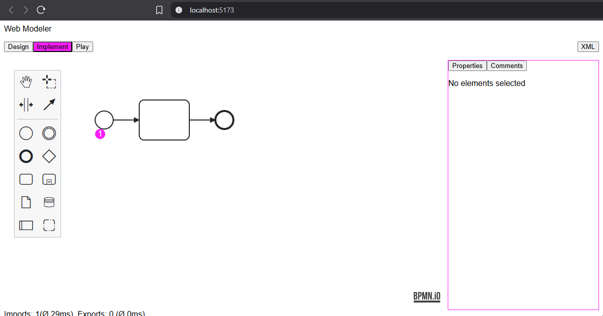

# Web Modeler Next

This prototype solves some of the current Web Modeler issues in a way similar to Desktop Modeler without using MobX.

## What problems does MobX solve in Web Modeler?

1. Persisting modeler and other state independent of component lifecycle
2. Access to shared state from React components and bpmn-js extensions
3. Automatic rerender on shared state update

All of these issues can be solved without MobX:

### 1. Persisting modeler and other state independent of component lifecycle

* simple caching feature for persisting modeler and other state
* can be replaced by MobX to make `subscribe` obsolete

### 2. Access to shared state from React components and bpmn-js extensions

* React components access cache through hooks
* bpmn-js extensions access cache directly

### 3. Automatic rerender on shared state update

* `subscribe` to explicitly rerender on shared state update

## Additional problems solved by this prototype:

### 1. Single source of truth for XML

* all views share the same XML

### 2. No unwanted imports or exports

* BPMN editor remembers last XML to prevent unwanted imports and exports
* exports are throttled

## Demo

